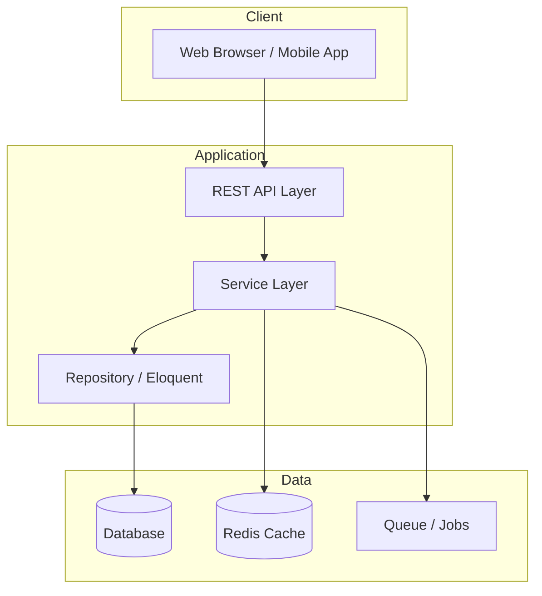

# Architecture Overview

**Author:** Abdel Rahman Waleed Ahmed

This folder contains system architecture diagrams for all portfolio projects. Each diagram uses Mermaid syntax — viewable in GitHub, VS Code, or any Mermaid renderer.

## Projects

| Project | Pattern | Database | Docs |
|---------|---------|----------|------|
| BlackHorse | Node.js REST + Socket.IO | MongoDB | [blackhorse.md](./blackhorse.md) |
| Real Estate All-Stars | Laravel MVC + Blade | MySQL | [real-estate-all-stars.md](./real-estate-all-stars.md) |
| ERP Arabia | Laravel API + Vue SPA | MongoDB + Redis | [erp-arabia.md](./erp-arabia.md) |
| BoatBnB + ERP | Laravel monorepo | MongoDB + MySQL | [boatbnb-erp.md](./boatbnb-erp.md) |
| Eastern & Co | Laravel modular (8 modules) | MySQL | [easternco-law-erp.md](./easternco-law-erp.md) |
| Estshary Admin | Laravel admin + JWT API | MySQL | [estshary-admin.md](./estshary-admin.md) |
| HR System | Laravel API + React SPA | MongoDB | [hr-system.md](./hr-system.md) |
| TRC Referrals | Laravel admin + Sanctum API | MySQL | [trc-referrals.md](./trc-referrals.md) |

## Common Patterns

## Design Principles

1. **Layered architecture** — Routes → Controllers → Services → Repositories
2. **RBAC everywhere** — Spatie Permission or custom role guards on admin modules
3. **Bilingual first** — EN/AR with RTL support on user-facing systems
4. **Export-ready** — PDF/Excel on all ERP and HR reporting modules
5. **Real-time where needed** — Socket.IO for orders; FCM for mobile push
