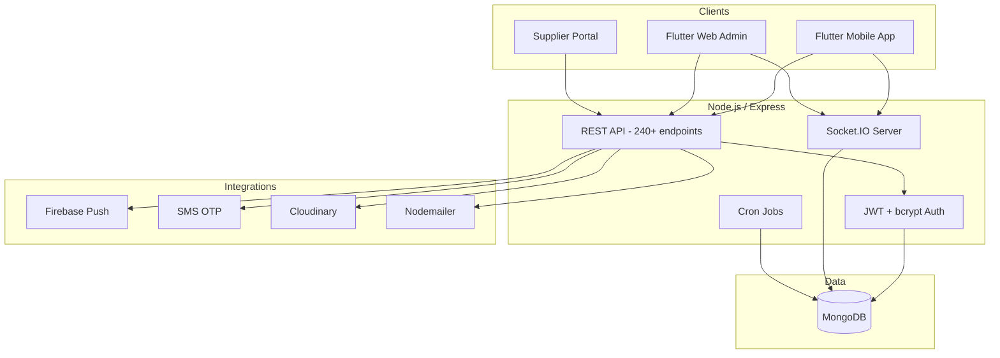
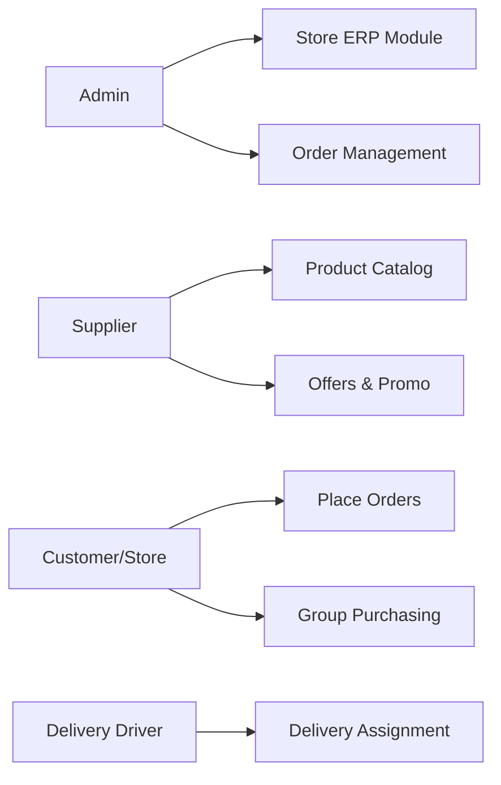
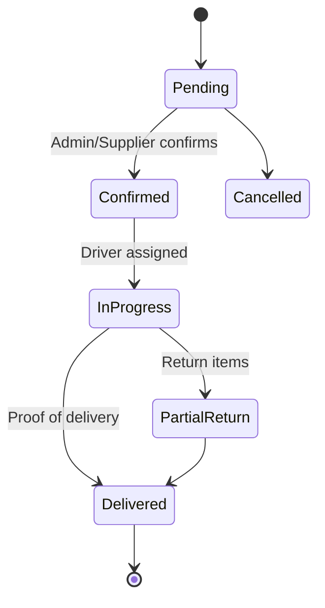

# BlackHorse — System Architecture

## High-Level Architecture

## Role-Based Access

## Order Lifecycle

## Key Components

| Component | Responsibility |
|-----------|----------------|
| `routes/` | Express route definitions by domain |
| `models/` | Mongoose schemas (orders, products, users) |
| `utils/cronJobs.js` | Group expiry, pending order checks |
| `utils/balanceSheet.js` | Supplier/customer accounting |
| Socket handlers | Real-time order updates, chat messages |

## Scalability Notes

- MongoDB horizontal scaling for order volume
- Socket.IO rooms per order/group for targeted broadcasts
- Cron jobs for batch processing (group expiry, fines)
- Stateless JWT API enables horizontal Express scaling behind load balancer
