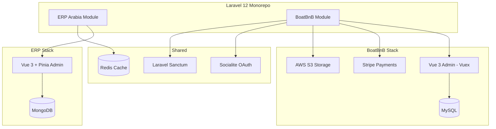

# BoatBnB + ERP Monorepo — System Architecture

## Dual-Database Strategy

| Product | Database | Rationale |
|---------|----------|-----------|
| ERP Arabia | MongoDB | Flexible inventory documents across branches |
| BoatBnB | MySQL | Relational bookings, payments, user accounts |

Both products share Laravel 12 infrastructure (auth, queue, mail) while maintaining separate data stores.
