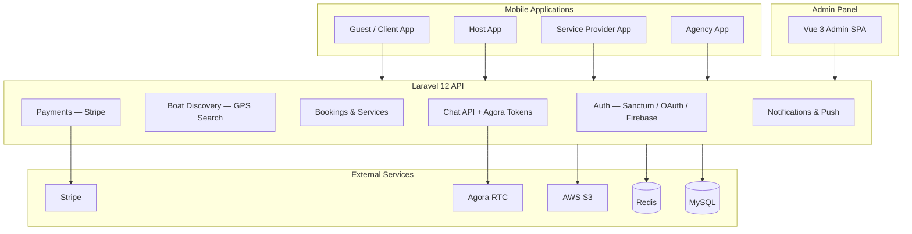

# BoatBnB — System Architecture

Full-stack boat booking platform with role-based mobile clients, Laravel API, and Vue 3 admin.

## Role-Based Access

| Role | API prefix / middleware | Primary actions |
|------|-------------------------|-----------------|
| Guest | Authenticated mobile routes | Search, book, pay, chat, review |
| Host | `/host/*` — `role:host,agency` | CRUD boats, accept/reject bookings |
| Service provider | `/service-provider/*` — `role:service_provider` | CRUD services |
| Agency | Host routes + boat transfers | Fleet management |
| Admin | `/api/admin/*` — `admin` middleware | Moderation, reports, insurance |

## GPS & Location

- Every boat stores `latitude` / `longitude`
- `BoatDiscoveryController` exposes search, nearby (radius), featured, and category endpoints
- `WeatherController` returns current, forecast, and marine data by coordinates or boat ID

## Payments Flow

1. Guest selects boat + rental type + optional services
2. `PaymentController` calculates total (promo codes, insurance)
3. Stripe payment method charged; invoice generated
4. Host/agency receives payout via Stripe Connect pipeline

## Chat Architecture

- **REST layer:** conversations, messages, attachments (S3), unread counts, search
- **Realtime layer:** Agora RTC for voice/video calls between booking parties
- Push notifications via FCM device tokens on user profile

## Internationalization

- User `language` preference stored per account
- Mobile and admin UI support **10 languages** via i18n (vue-i18next on admin; mobile locale bundles)
- RTL-aware layouts for Arabic and similar locales

## Data Model Highlights

| Entity | Key relationships |
|--------|---------------------|
| User | role, boats (owner/agency), services, bookings, chats |
| Boat | owner, agency, GPS coords, tags, insurance, transfers |
| Booking | guest, boat, services, payment, review |
| Service | provider, boat, pricing |
| Chat / Message | participants, attachments, read state |
