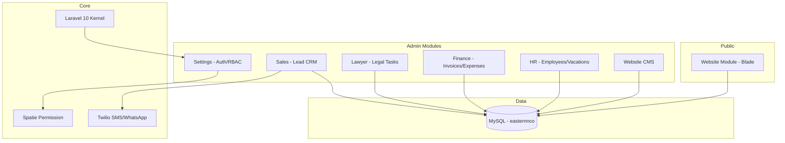
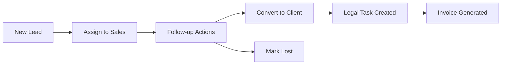
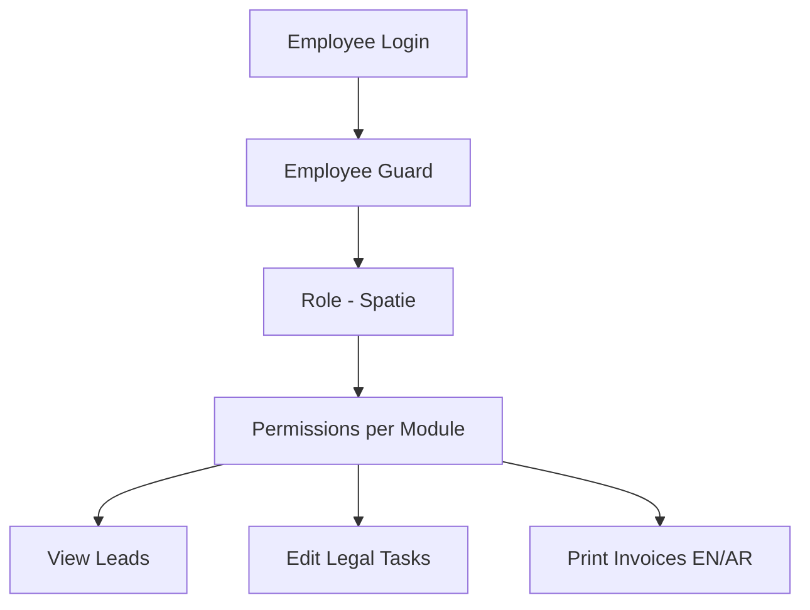

# Eastern & Co — System Architecture

## Modular Architecture (nwidart/laravel-modules)

## Lead CRM Pipeline

## Permission Model

## Module Responsibilities

| Module | Purpose |
|--------|---------|
| **Settings** | Auth, countries, cities, configurations, RBAC |
| **Sales** | Lead CRM, follow-ups, bulk Excel import, SMS |
| **Lawyer** | Legal task workflow (manager/lawyer/finance views) |
| **Finance** | Invoices, expenses, safes, petty cash |
| **HR** | Employees, vacations, job applications |
| **Website** | Public pages, blog, careers, contact forms |
