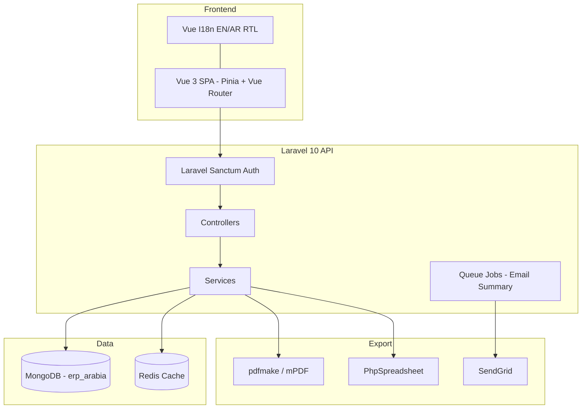
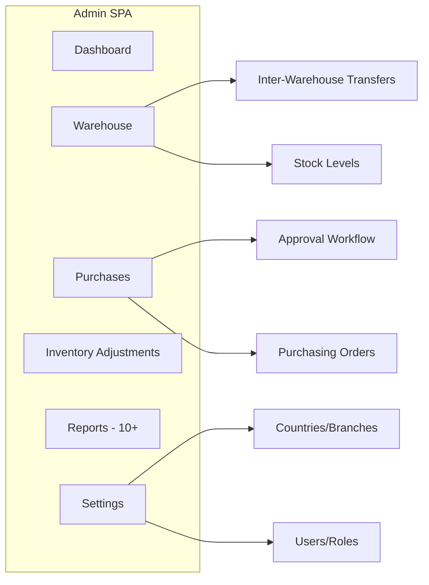
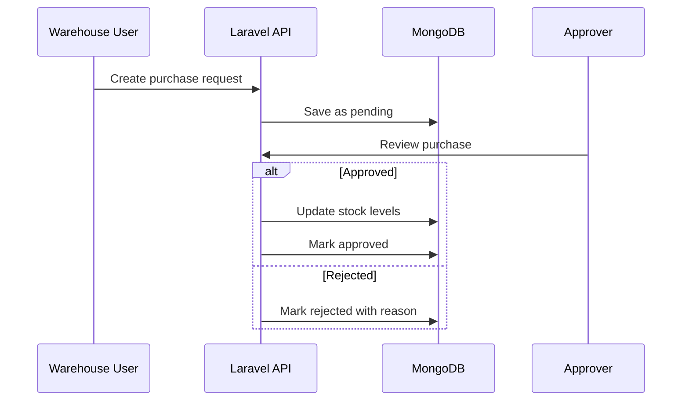

# ERP Arabia — System Architecture

## High-Level Architecture

## Module Structure

## Purchase Approval Flow

## Tech Decisions

| Decision | Rationale |
|----------|-----------|
| MongoDB over MySQL | Flexible document schema for multi-branch inventory |
| Vue SPA separate from Laravel | Rich client-side reporting and RTL document generation |
| Redis caching | Fast lookup for settings, branches, permissions |
| Pinia over Vuex | Modern Vue 3 state management with TypeScript-ready stores |
