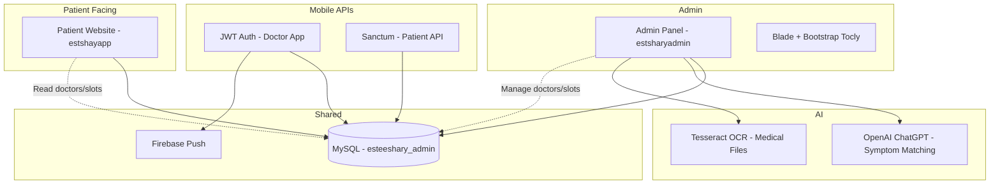
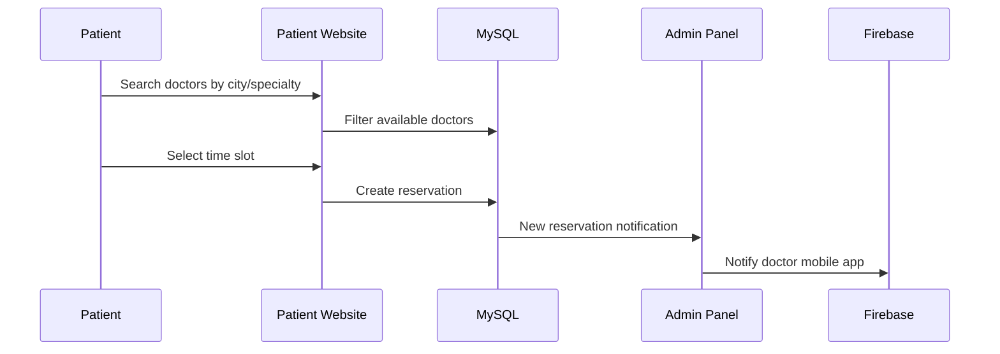

# Estshary Healthcare — System Architecture

```mermaid
flowchart TB
    subgraph Patient Facing
        PATIENT[Patient Website - estshayapp]
    end

    subgraph Admin
        ADMIN[Admin Panel - estsharyadmin]
        BLADE[Blade + Bootstrap Tocly]
    end

    subgraph Mobile APIs
        JWT[JWT Auth - Doctor App]
        SANCTUM[Sanctum - Patient API]
    end

    subgraph AI
        GPT[OpenAI ChatGPT - Symptom Matching]
        OCR[Tesseract OCR - Medical Files]
    end

    subgraph Shared
        MYSQL[(MySQL - esteeshary_admin)]
        FIREBASE[Firebase Push]
    end

    PATIENT --> MYSQL
    ADMIN --> MYSQL
    JWT --> MYSQL
    SANCTUM --> MYSQL
    ADMIN --> GPT
    ADMIN --> OCR
    JWT --> FIREBASE
    PATIENT -.->|Read doctors/slots| MYSQL
    ADMIN -.->|Manage doctors/slots| MYSQL
```

## Appointment Booking Flow

```mermaid
sequenceDiagram
    participant Patient
    participant Site as Patient Website
    participant DB as MySQL
    participant Admin as Admin Panel
    participant Push as Firebase

    Patient->>Site: Search doctors by city/specialty
    Site->>DB: Filter available doctors
    Patient->>Site: Select time slot
    Site->>DB: Create reservation
    DB->>Admin: New reservation notification
    Admin->>Push: Notify doctor mobile app
```
