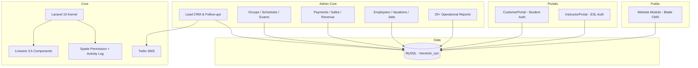
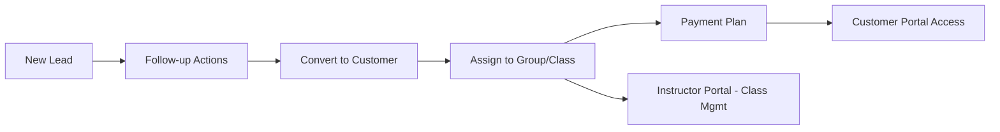

# Harvest British College (SYS) — System Architecture

## Modular Architecture (nwidart/laravel-modules)



## Lead-to-Enrollment Pipeline



## Multi-Portal Access Model

```mermaid
flowchart TB
    subgraph Guards
        EMP[Employee Guard - Admin/CRM]
        CUST[Customer Guard - Student Portal]
        INST[Employee Guard + checkInstructor]
    end

    EMP --> RBAC[Spatie RBAC - permissionHandler]
    RBAC --> ADMIN[Admin Routes /admin/*]
    CUST --> CP[/customerPortal/*]
    INST --> IP[/instructorPortal/*]
```

## Permission Model

Route names map to Spatie permissions via `PermissionHandler` middleware:

| Route action | Permission pattern |
|--------------|-------------------|
| index, show | `{resource} view` |
| create, store | `{resource} create` |
| edit, update | `{resource} edit` |
| destroy | `{resource} delete` |

Super admin bypass: `Gate::before` grants all abilities to employee ID 1.

Admin access requires `account_Type` of `H.Q Account` or `Operations Account` (`CheckAdmin` middleware).

## Module Responsibilities

| Module / Area | Purpose |
|---------------|---------|
| **Website** | Public pages, offers, events, gallery, branches, job applications |
| **CustomerPortal** | Registration, OTP login, courses, payments, placement tests |
| **InstructorPortal** | Schedule, classes, attendance, exams, monitoring, chat |
| **Admin CRM** | Leads, sources, labels, follow-ups, Dutch leads |
| **Operations** | Groups, schedules, placement, certificates, warehouse |
| **Finance** | Safes, expenses, payment reports, Fawry hooks |
| **HR** | Employees, departments, vacations, resignations |

## Deployment

- **Production:** `https://harvestcollege.co.uk` (APP_NAME=Harvest, DB=harvestc_sys)
- **Source:** `harvest/` monolith with modular structure
