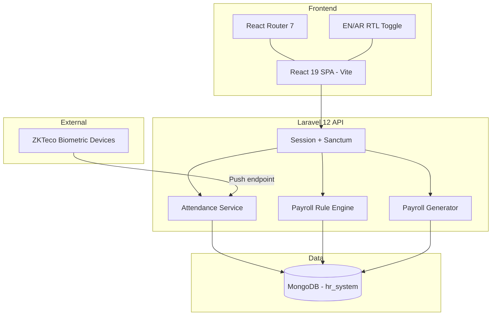
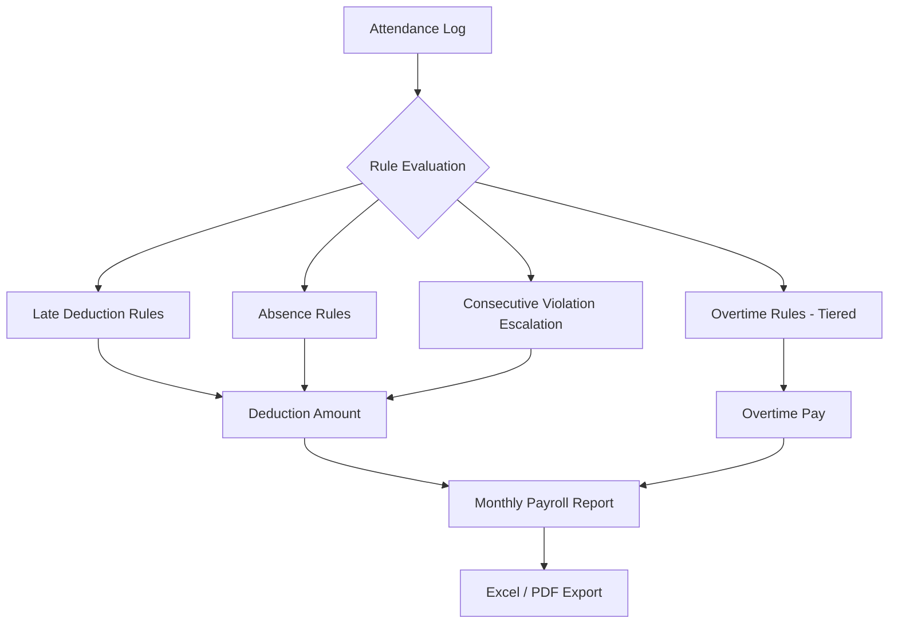
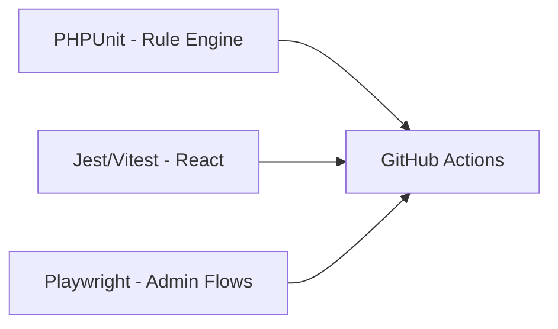

# HR System — System Architecture

## High-Level Architecture

## Payroll Rule Engine

## Domain Modules

| Module | Entities | Key Logic |
|--------|----------|-----------|
| Employees | Employee, Department, Position | Auto-generated codes, org hierarchy |
| Attendance | Shift, Device, AttendanceLog | ZKTeco push, manual entry, bulk import |
| Leave | LeaveType, LeaveRequest | Balance tracking, approval workflow |
| Payroll | DeductionRule, OvertimeRule, TaxBracket | Configurable rule engine |
| Reports | PayrollReport, AttendanceReport | Excel/PDF export |

## Testing Strategy

