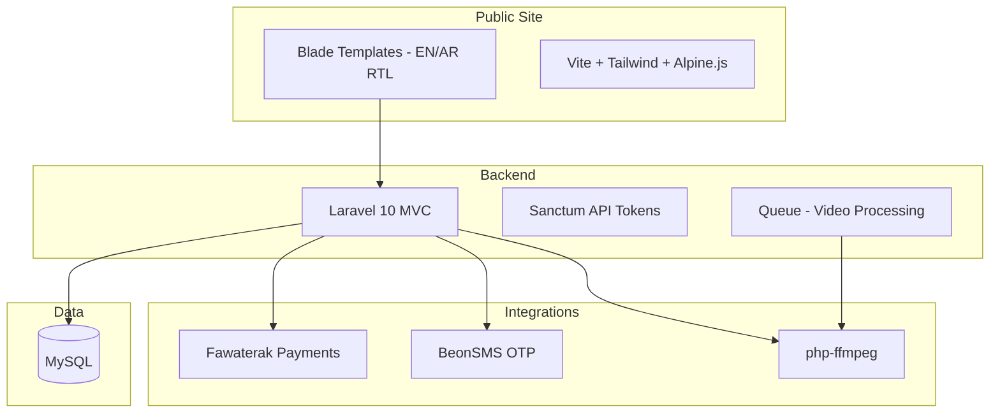
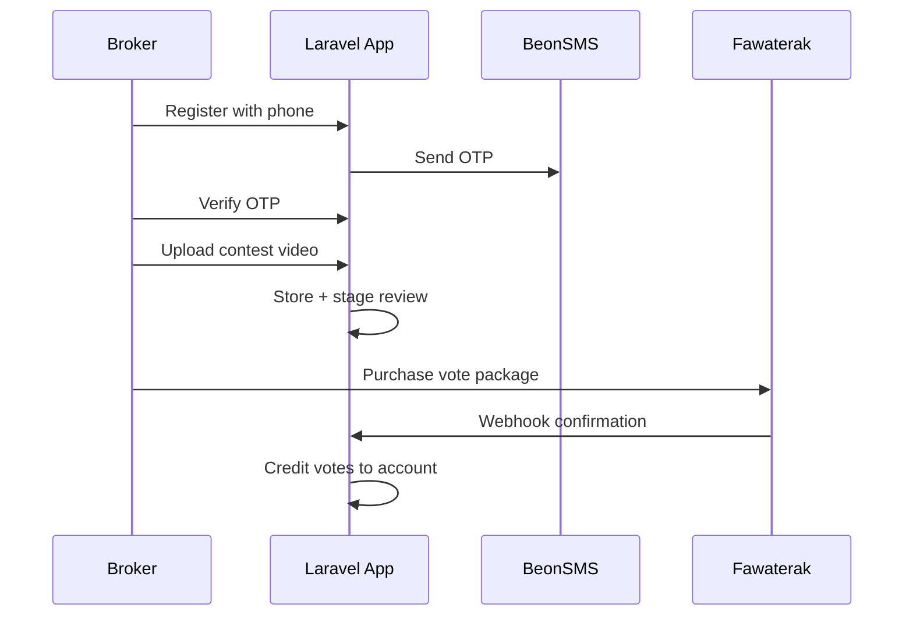

# Real Estate All-Stars — System Architecture

```mermaid
flowchart TB
    subgraph Public Site
        BLADE[Blade Templates - EN/AR RTL]
        VITE[Vite + Tailwind + Alpine.js]
    end

    subgraph Backend
        LARAVEL[Laravel 10 MVC]
        SANCTUM[Sanctum API Tokens]
        QUEUE[Queue - Video Processing]
    end

    subgraph Integrations
        FAW[Fawaterak Payments]
        SMS[BeonSMS OTP]
        FFMPEG[php-ffmpeg]
    end

    subgraph Data
        MYSQL[(MySQL)]
    end

    BLADE --> LARAVEL --> MYSQL
    LARAVEL --> FAW
    LARAVEL --> SMS
    LARAVEL --> FFMPEG
    QUEUE --> FFMPEG
```

## Contest Flow

```mermaid
sequenceDiagram
    participant Broker
    participant App as Laravel App
    participant SMS as BeonSMS
    participant Pay as Fawaterak

    Broker->>App: Register with phone
    App->>SMS: Send OTP
    Broker->>App: Verify OTP
    Broker->>App: Upload contest video
    App->>App: Store + stage review
    Broker->>Pay: Purchase vote package
    Pay->>App: Webhook confirmation
    App->>App: Credit votes to account
```
