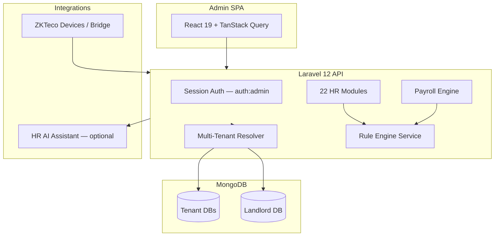

# RNS HR — System Architecture

Production HRMS for RNS Cinemas with modular Laravel backend and React SPA admin.

## Modular structure

Each module under `Modules/{Name}/` contains:

- `Config/routes.php` — API routes
- `Controllers/Api/` — thin controllers
- `Services/` — business logic
- `Models/` — MongoDB models
- `Domain/Contracts/` — repository interfaces

Cross-cutting app code lives in `app/` (auth, payroll orchestration, tenant middleware).

## Multi-tenancy

- **Landlord DB:** tenant registry, domains, SaaS plans
- **Tenant DB:** all HR operational data per client
- Resolved via hostname / tenant middleware on each request

## Attendance pipeline

1. ZKTeco device or bridge pushes punch to `/api/v1/attendance/*`
2. Attendance service normalizes events into daily ledger
3. Rule engine applies late, absence, overtime, violation rules
4. Payroll run consumes processed attendance + employee components

## Production

- **URL:** https://hr-app.rnscinemas.com/hr
- **Path prefix:** `/hr` stripped in `public/index.php` before Laravel routing
- Config via `config/deployment.php` (gitignored) + `config/hrsys_database.php`
