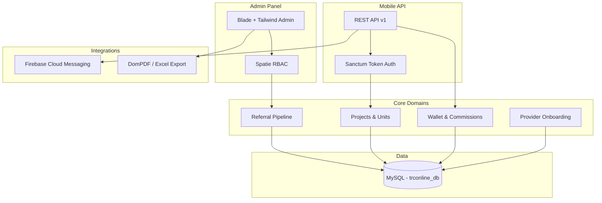
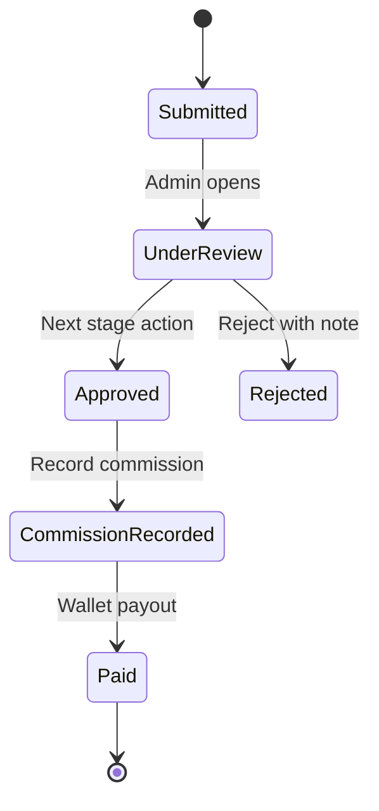

# TRC Referrals — System Architecture

```mermaid
flowchart TB
    subgraph Admin Panel
        BLADE[Blade + Tailwind Admin]
        SPATIE[Spatie RBAC]
    end

    subgraph Mobile API
        SANCTUM[Sanctum Token Auth]
        API[REST API v1]
    end

    subgraph Core Domains
        REF[Referral Pipeline]
        PROJ[Projects & Units]
        WALLET[Wallet & Commissions]
        PROV[Provider Onboarding]
    end

    subgraph Integrations
        FCM[Firebase Cloud Messaging]
        PDF[DomPDF / Excel Export]
    end

    subgraph Data
        MYSQL[(MySQL - trconline_db)]
    end

    BLADE --> SPATIE --> REF
    API --> SANCTUM --> PROJ
    API --> WALLET
    REF --> MYSQL
    PROJ --> MYSQL
    WALLET --> MYSQL
    PROV --> MYSQL
    API --> FCM
    BLADE --> PDF
```

## Referral Pipeline Stages

```mermaid
stateDiagram-v2
    [*] --> Submitted
    Submitted --> UnderReview: Admin opens
    UnderReview --> Approved: Next stage action
    UnderReview --> Rejected: Reject with note
    Approved --> CommissionRecorded: Record commission
    CommissionRecorded --> Paid: Wallet payout
    Paid --> [*]
```
