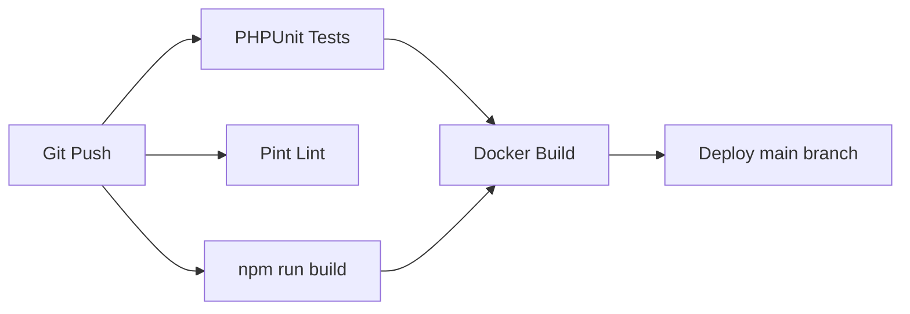

# CI/CD Pipeline Examples

Copy these GitHub Actions workflows to your project's `.github/workflows/` directory.

## Available Workflows

| File | Purpose | Best For |
|------|---------|----------|
| [laravel-ci.yml](./.github/workflows/laravel-ci.yml) | PHPUnit tests, Pint lint, frontend build, Docker push | Laravel projects (ERP, HR, TRC, Estshary) |
| [nodejs-ci.yml](./.github/workflows/nodejs-ci.yml) | npm test, lint, security audit, deploy | BlackHorse Node.js API |
| [docker-deploy.yml](./.github/workflows/docker-deploy.yml) | Build/push Docker image, SSH deploy | Production deployments |

## Laravel CI Pipeline



## Required Secrets

| Secret | Used By | Description |
|--------|---------|-------------|
| `DEPLOY_HOST` | docker-deploy | Production server IP/hostname |
| `DEPLOY_USER` | docker-deploy | SSH username |
| `DEPLOY_KEY` | docker-deploy | SSH private key |

## Docker Compose Example

See [docker-compose.example.yml](../docker-compose.example.yml) for local development with MySQL, MongoDB, and Redis.

## Usage

```bash
# Copy workflows to your project
cp -r github-examples/.github/workflows/ /path/to/your-project/.github/workflows/

# Copy Docker compose for local dev
cp github-examples/docker-compose.example.yml /path/to/your-project/docker-compose.yml
```
