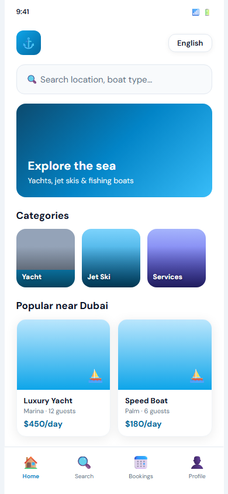

# BoatBnB + ERP — Multi-Platform Boat Rental Marketplace & Operations System

Multi-platform boat rental ecosystem with customer, provider, agency, guest, and admin applications featuring real-time chat, GPS tracking, multilingual support, Stripe payments, and an integrated ERP system.

**Sole developer responsible for business analysis, architecture, frontend, backend, infrastructure, testing, deployment, and maintenance.**

## Project Details

| Field | Value |
|-------|-------|
| Industry | Travel & Marine Services |
| Role | Sole Full-Stack Engineer & Solutions Architect |
| Duration | Jul 2025 – Jan 2026 |
| Team Size | 1 |
| Platforms | Web Admin, Provider Portal, Customer App, Agency App |
| Languages Supported | 10 |

## Tech Stack

Laravel 12, PHP 8.2, Vue.js 3, MySQL, MongoDB, Redis, Sanctum, Socialite, Stripe, AWS S3, Agora SDK, Firebase, Docker, Nginx

## Key Features

- Boat discovery and search
- GPS tracking
- Booking and scheduling
- Stripe payments
- Referral system
- Real-time chat with Agora
- Multi-language support (10 languages)
- Provider onboarding
- Commission and payout management
- Notifications
- Admin ERP dashboard
- Analytics and reporting

## Links

- **Live portfolio:** https://abdelrahman1203.github.io/project.html?id=04-boatbnb-erp-monorepo
- **Full portfolio repo:** https://github.com/Abdelrahman1203/Abdelrahman1203.github.io

## Documentation

- [Architecture](../../docs/architecture/boatbnb-erp.md)
- [API Reference](../../docs/api/boatbnb-erp.md)
- [Case Study](../../case-studies/boatbnb-erp.md)

## Author

Abdel Rahman Waleed Ahmed
