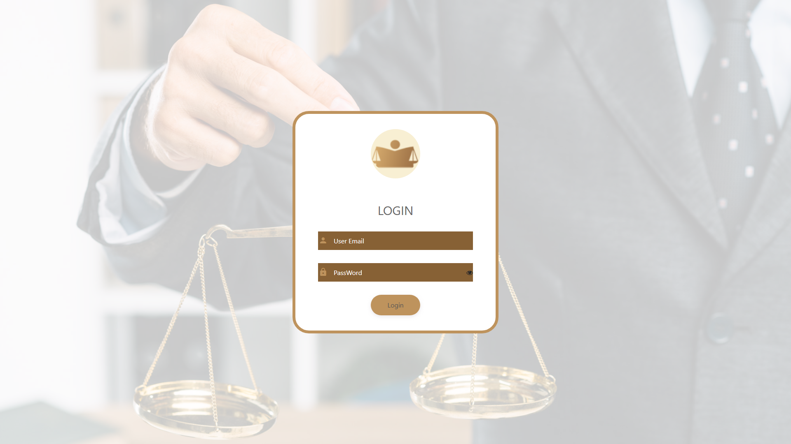

# Eastern & Co — Law Firm ERP/CRM

Modular Laravel ERP/CRM for Eastern & Co law firm with lead CRM, legal task workflows, HR, finance, and bilingual public website.



## Tech Stack

- Laravel 10, nwidart/laravel-modules (8 modules), MySQL
- Spatie Permission, Twilio SMS/WhatsApp, reCAPTCHA
- Blade, Vite, bilingual EN/AR

## Modules

| Module | Purpose |
|--------|---------|
| Settings | Auth, RBAC, configurations |
| Sales | Lead CRM, follow-ups, Excel import |
| Lawyer | Legal task workflow |
| Finance | Invoices, expenses, safes |
| HR | Employees, vacations, recruitment |
| Website | Public site + CMS |

## Quick Start

```bash
cp .env.example .env
composer install && npm install
php artisan migrate
php artisan module:seed
php artisan serve --port=8204
```

## Documentation

- [Architecture](../../docs/architecture/easternco-law-erp.md)
- [Case Study](../../case-studies/easternco-law-erp.md)

## Live Domain

easternnco.com

## Author

Abdel Rahman Waleed Ahmed
