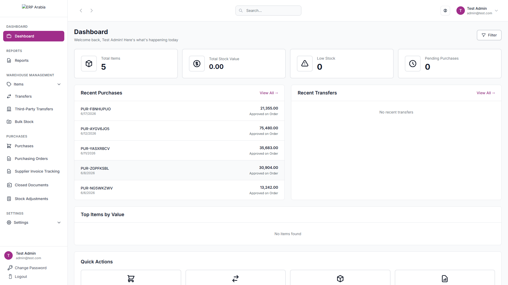

# ERP Arabia — Warehouse & Inventory ERP

Vue.js 3 refactored ERP for multi-branch warehouse operations with purchase workflows, inter-warehouse transfers, and bilingual Arabic RTL reporting.



## Tech Stack

- **Backend:** Laravel 10, MongoDB, Redis, Sanctum
- **Frontend:** Vue 3, Pinia, Vue Router, Vue I18n, Tailwind CSS, Vite
- **Export:** pdfmake, jsPDF, mPDF, PhpSpreadsheet

## Features

- Multi-branch settings (countries, companies, branches, users, roles)
- Warehouse: categories, stock levels, transfers, bulk entry
- Purchase approval workflow with grouped invoices
- 10+ exportable reports (PDF/Excel)
- Bilingual EN/AR admin SPA with RTL document support

## Quick Start

```bash
cd vue-app
cp .env.example .env
composer install && npm install
php artisan migrate --seed
php artisan serve --port=8001
npm run dev
```

**Demo login:** `admin@test.com` / `password123`  
**SPA URL:** `http://localhost:8001/erp_hr/login`

## Documentation

- [Architecture](../../docs/architecture/erp-arabia.md)
- [API Reference](../../docs/api/erp-arabia.md)
- [Case Study](../../case-studies/erp-arabia.md)

## Author

Abdel Rahman Waleed Ahmed
