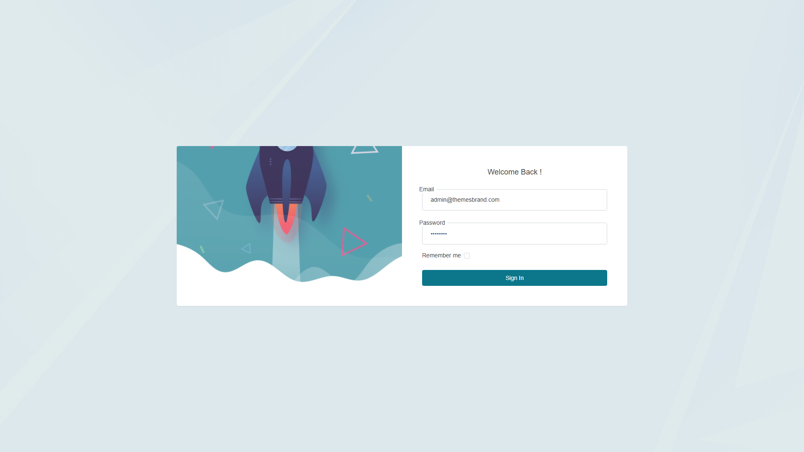

# Estshary — Healthcare Admin & API

Healthcare management admin panel with doctor/clinic booking, AI chatbot, Firebase notifications, and JWT mobile APIs.



## Tech Stack

- Laravel 10, MySQL, JWT Auth, Sanctum, Spatie Permission
- Bootstrap 5 Tocly admin, Firebase, OpenAI, Tesseract OCR

## Features

- Doctor & clinic management with schedules and approvals
- Appointment/reservation system with prescriptions
- AI-powered doctor recommendations (ChatGPT)
- Review moderation, financial invoicing, ads system
- 118+ database migrations

## Quick Start

```bash
cp .env.example .env
composer install && npm install
php artisan migrate --seed
php artisan serve --port=8205
```

## Documentation

- [Architecture](../../docs/architecture/estshary-admin.md)
- [API Reference](../../docs/api/estshary-admin.md)
- [Case Study](../../case-studies/estshary-admin.md)

## Related

Patient website: [estshary-patient](../estshary-patient/README.md)

## Author

Abdel Rahman Waleed Ahmed
