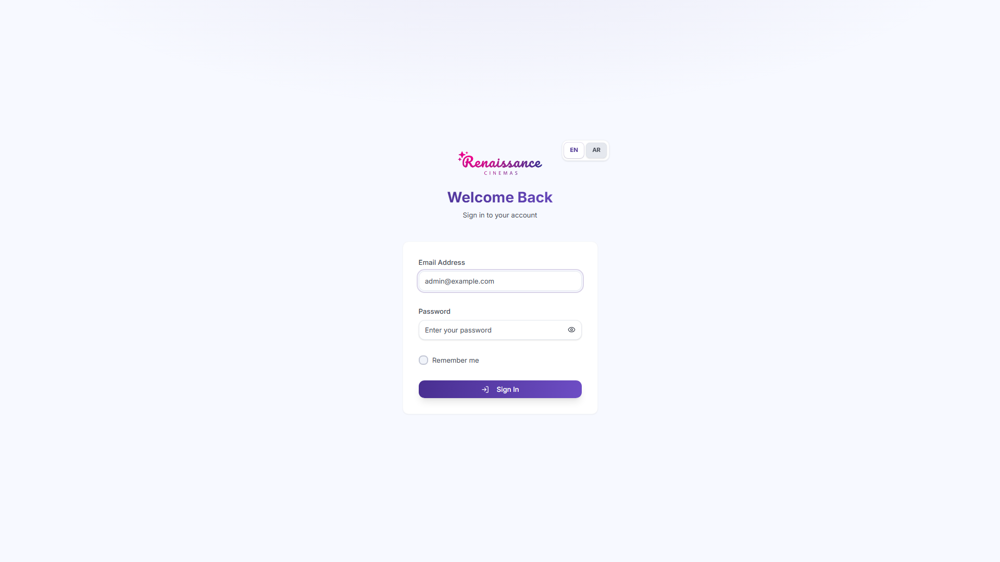

# RNS HR — Multi-Tenant HR Platform

Enterprise HRMS built for **RNS Cinemas** (Egypt) — employees, biometric attendance, payroll, leave, violations, and multi-branch operations on a Laravel 12 + React 19 + MongoDB stack.

**Live:** https://hr-app.rnscinemas.com/hr

## Tech Stack

- Laravel 12, PHP 8.3, MongoDB (multi-tenant)
- React 19, TanStack Query, Tailwind CSS 4, Vite 6
- ZKTeco attendance bridge, Sanctum, Playwright E2E
- Docker, GitHub Actions CI

## Features

- 22 modular HR domains (Employee, Attendance, Payroll, Leave, Violation, Device, …)
- Configurable deduction/overtime rule engine
- Multi-tenant SaaS (landlord + tenant databases)
- RBAC: super-admin, admin, editor, branch-manager
- Bilingual EN/AR with RTL
- Integration tokens, data import, HR audit trail



## Quick Start

```bash
composer install && npm install
cp config/deployment.example.php config/deployment.php  # set local app_url
composer setup-local-tenant
npm run build && php artisan serve
# Login: admin@example.com / password
```

## Documentation

- [Architecture](../../docs/architecture/rns-hr.md)
- [API Reference](../../docs/api/rns-hr.md)
- [Case Study](../../case-studies/rns-hr.md)

## Author

Abdel Rahman Waleed Ahmed
